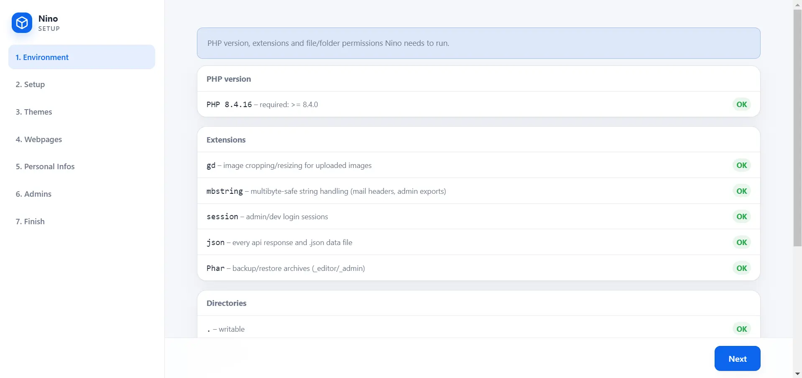
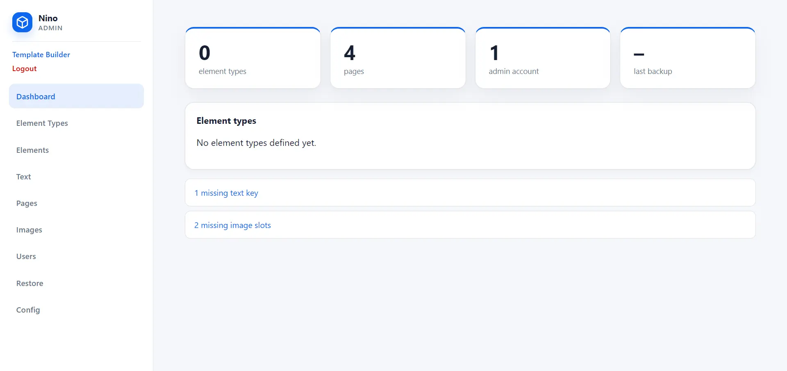
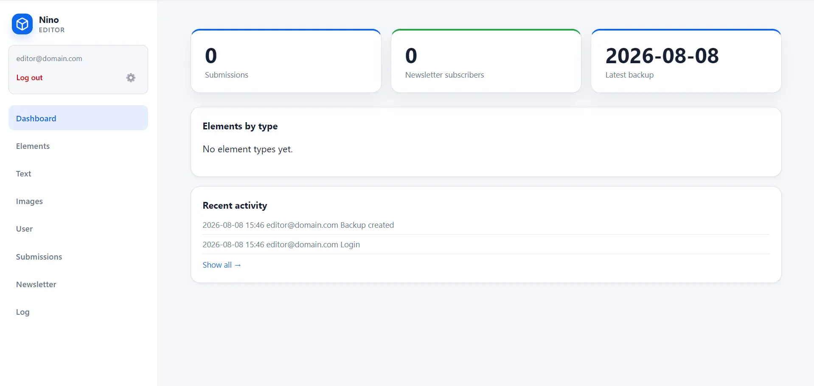
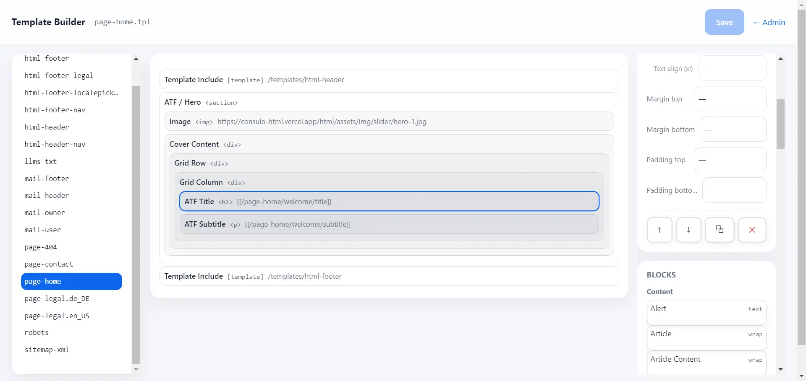

# Hi, I am Nino.

**Language:** English · [Deutsch](README.de.md)

**[Live Demo](https://demo.getnino.dev)** ·

## Build websites simply with Nino

Nino is a lean foundation for modern PHP websites. It works entirely without a database or external packages and avoids unnecessary bloat. Developers retain control over the frontend, templates, and functionality; editors and site owners maintain content through a streamlined GUI.
Nino does not get lost in possibilities—it puts content on the web.

The entire project remains a readable set of files that can be versioned with Git and runs on standard PHP hosting. The initial setup takes only a few minutes and leaves a working foundation for further development. Developers can equip it with the tools they need and add custom functionality through a flexible callback system.
Multilingual content, posts and elements, forms, newsletters, user permissions, and backups are already included.

## Why another CMS?

There are excellent PHP solutions for websites:
Mature systems such as WordPress cover almost every use case with themes, plugins, and a large community. This versatility is their strength—and also their greatest weakness.
Technical frameworks such as Laravel enable highly complex applications, but require a more extensive Composer-based environment and additional frontend tooling for conventional websites.
Pure HTML/CSS/JavaScript websites, on the other hand, are very lean but repeatedly need to reinvent editorial features.

**Nino occupies the space between them:** a practical foundation for dynamic websites. Developers can adapt projects quickly; site owners get a simple interface for essential content maintenance.

## Who is Nino for?

Nino is primarily intended for web developers and small agencies that build individual, conventional websites and may hand them over to third parties for content maintenance.

Solid HTML, CSS, and JavaScript skills plus basic PHP knowledge are useful for implementation. Custom modules, APIs, or databases can be integrated, but require correspondingly greater PHP experience.

## The pillars of Nino

### Frontend — simple, yet individual


The frontend is built from simple HTML-based templates, textfills, shortcodes, and recurring elements. Nino does not impose a ready-made page structure: the visible result remains an individual project.

The included design system, with its base components and modules, provides a quick starting point for conventional websites. Multilingual content, responsive design, performance, and security remain part of the project.

### `/_install` — a quick start for the project



Every fresh checkout is configured through `/_install`. The wizard checks the environment, guides you through languages, modules, and the theme, copies the required assets, creates initial pages and basic information, and sets up access to `/_editor` and `/_admin`.

The developer can then begin working on the project immediately.

### `/_admin` — optional: the GUI for developers



In `/_admin`, the developer manages the website’s technical and content structure: element types, elements and texts, images, pages and routes, users, and configuration.

The interface provides full access for development, diagnostics, and corrections and is therefore reserved for a separate technical account. All changes can alternatively be made directly in the file system.

### `/_editor` — optional: maintain content with ease



`/_editor` is the everyday interface for editors and site owners. It is used to maintain texts, recurring content, and images, as well as to manage form submissions, newsletter subscribers, user permissions, and logs.

The developer determines which content is visible and which areas an account actually needs.

### `/_templates` — optional, Alpha



`/_templates` is a graphical structure editor for `page-*.tpl` and `section-*.tpl`. The Template Builder displays grids, spacing, and nested blocks, derives its settings from HTML tags and CSS classes, and continues to save readable HTML+ in the regular template files.

It is deliberately **not a visual preview of the finished website**.

> **Status: Alpha.** The data format remains plain `.tpl` markup, but the interface, block library, and workflows may still change significantly.

## What Nino includes

* multilingual routing, texts, and content
* a dedicated template system with shortcodes and a clear separation of HTML and PHP
* an optional Template Builder for `.tpl` files (Alpha)
* a file-based content model for textfills and recurring elements
* themes, asset bundling, and frontend base components
* forms, newsletters, navigation, language selection, and image processing
* users, granular permissions, login protection, and activity logs
* automatic encrypted backups and restoration
* an integrated callback system for custom modules and integrations

## Nino vs. WordPress, Laravel, Kirby, and Grav

None of these systems is inherently better than the others. They simply start from different premises and emphasize different priorities.

*As of August 2026*

| System | Approach | Technical foundation | Particularly suitable for |
| --- | --- | --- | --- |
| **Nino** | Compact website framework with its own editorial interface | PHP and file system; no database or external packages | Individual multilingual websites with a clear handover from developers to editors |
| **WordPress** | Universal content-oriented CMS with a large theme and plugin ecosystem | PHP with MySQL or MariaDB | Projects that benefit from ready-made extensions, themes, and a large community |
| **Laravel** | Full-stack framework for web applications | Composer-based PHP ecosystem | Custom applications, complex business logic, and scalable infrastructure |
| **Kirby** | Flexible flat-file CMS with a mature panel and plugin platform | File-based content and modern PHP | Custom websites with an established flat-file ecosystem |
| **Grav** | Open-source flat-file CMS with themes and plugins | Markdown, Twig, Symfony components, and a package manager | File- and Markdown-oriented websites with an open extension ecosystem |

Nino deliberately chooses a smaller scope: **no universal plugin ecosystem, no abstract application toolkit, and no database.**

In return, the stable kernel, fast setup, developer tools, and editorial interface form a coherent workflow specifically designed for individual websites.

By dispensing with an open plugin system and third-party runtime packages, Nino reduces its attack surface as well as update and supply-chain risks. Less third-party code and fewer interdependent versions make the installed codebase easier to understand and audit.

**This does not replace secure development, but it significantly reduces update and maintenance effort.**

## Quick Start

Nino requires **PHP 8.4 or newer** with the `gd` extension and `phar.ini` support for `PharData`. It starts without a package manager or build step:

```bash
git clone https://github.com/dapeio/nino.git
cd nino
php -S 127.0.0.1:8000 router.php
```

Then open http://127.0.0.1:8000/_install.

The wizard is required for a fresh checkout and creates the first working project state.

The complete process is described in **[Getting Started](docs/getting-started.md)**. All options and write operations are covered in the **[`/_install` Reference Manual](docs/_install.md)**.

## Project Structure

```text
index.php        Main entry point of the website
config.php       Site configuration

_nino/           Kernel and frontend core
_editor/         Content editor, users, backups, activity log
_admin/          Developer tools and restoration
_install/        Setup wizard
_templates/      Template Builder

elements/        Element types
templates/       Page and section templates
text/            Texts by language and global settings
assets/          Project-specific CSS and JavaScript
images/          Uploaded images
docs/            Documentation
data/            Runtime data, not tracked in Git
```

## Tests

Each file is a standalone script and runs against an isolated sandbox directory:

```bash
php tests/kernel-smoke.php
php tests/admin-smoke.php
php tests/editor-smoke.php
php tests/install-smoke.php
php tests/templates-smoke.php
php tests/concurrency-smoke.php
```

## Philosophy and technology

Nino deliberately keeps its architecture small: a central `$appData` array carries the application state, `$request` remains responsible for the HTTP request and response, and callbacks connect the kernel, modules, and templates.

## Further documentation

* **[Concepts](docs/concepts.md):** architecture, data flow, and separation of concerns
* **[Developer Manual](docs/development.md):** runtime contracts, APIs, modules, and tests
* **[Getting Started](docs/getting-started.md):** from checkout to a configured website
* **[`/_install` Reference](docs/_install.md):** steps, writing rules, and library format
* **[`/_admin` Manual](docs/_admin.md):** project structure, content, accounts, configuration, and restoration
* **[`/_templates` Manual](docs/_templates.md):** structural template editing with the Alpha builder
* **[`/_editor` Manual](docs/_editor.md):** texts, elements, images, submissions, and newsletters
* **[Deployment](docs/deployment.md):** web server, security, backups, and go-live
* **[Design Manual](docs/design.md):** frontend, design system, CSS, and template work **(WIP)**
* **[Security Policy](https://github.com/dapeio/nino/blob/main/SECURITY.md):** security reports and supported versions
* **[Changelog](https://github.com/dapeio/nino/blob/main/CHANGELOG.md):** changes between versions

## Status and Security

Nino as a whole is currently in the **Beta phase**. Individual optional tools have their own, lower maturity level:

| Area | Status |
| --- | --- |
| Kernel, frontend, and existing project foundation | Beta |
| `/_templates` | Alpha |

Security fixes land directly on `main`; there is no separate LTS version yet.

Security issues should not be reported as public issues. Contact details and the currently supported version are listed in the [Security Policy](https://github.com/dapeio/nino/blob/main/SECURITY.md).

## License

[MIT](https://github.com/dapeio/nino/blob/main/LICENSE)
