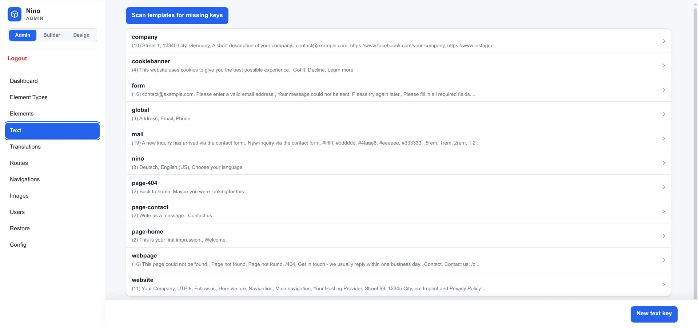
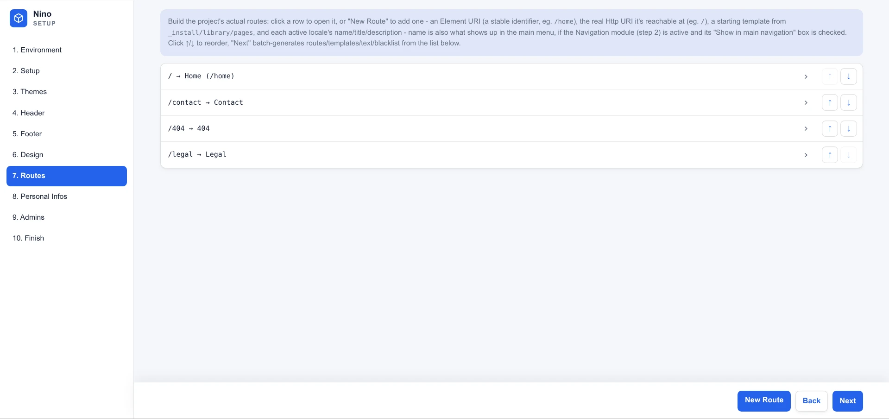
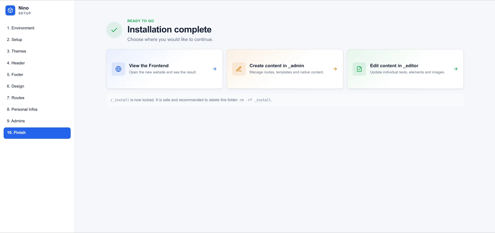
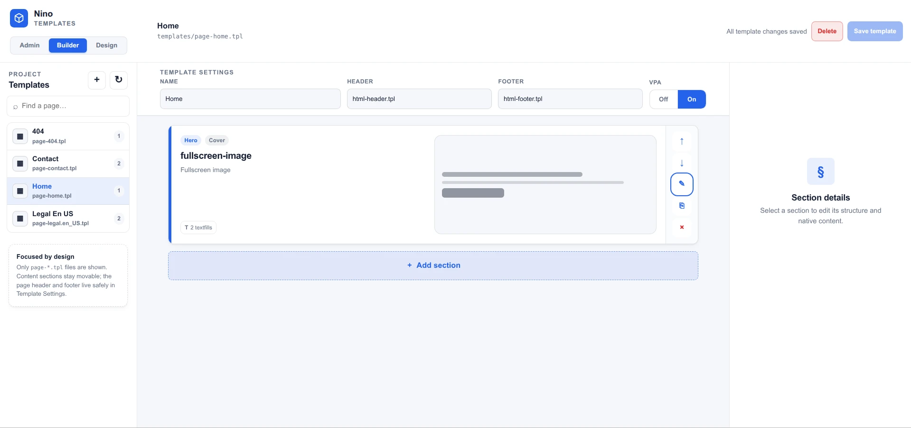
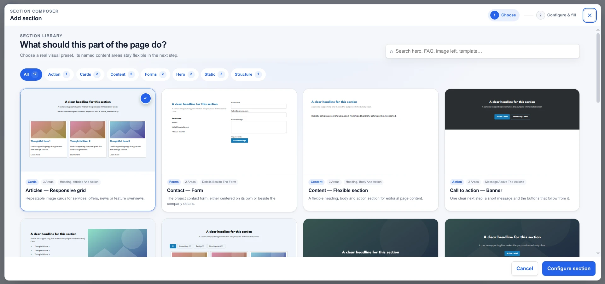
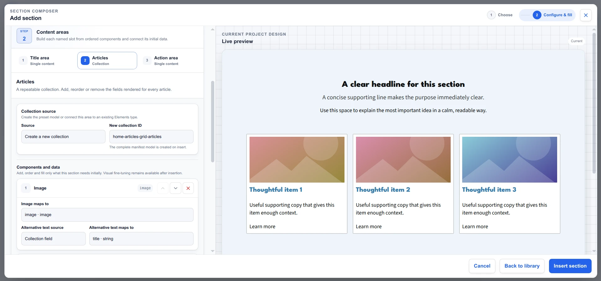
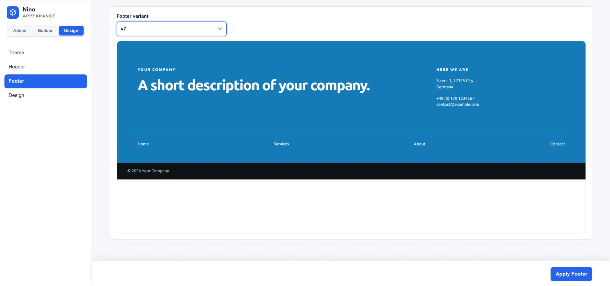

# Hi, I am Nino.

**Language:** English · [Deutsch](README.de.md)

**[Live Demo](https://demo.getnino.dev)**

## Build websites, not programs.

Nino is a lean foundation for modern PHP websites. It works entirely without a database or external packages and avoids unnecessary bloat. Developers retain control over the frontend, templates, and functionality; editors and site owners maintain content through a streamlined GUI.
Nino does not get lost in possibilities—it puts content on the web.

The entire project remains a readable set of files that can be versioned with Git and runs on standard PHP hosting. The initial setup takes only a few minutes and leaves a working foundation for further development. Developers can equip it with the tools they need and add custom functionality through a flexible callback system.
Multilingual content, posts and elements, forms, newsletters, user permissions, and backups are already included.

## Why another CMS?

There are excellent PHP solutions for websites:
Mature systems such as WordPress cover almost every use case with themes, plugins, and a large community. This versatility is their strength—and also their greatest weakness.
Technical frameworks such as Laravel enable highly complex applications, but require a more extensive Composer-based environment and additional frontend tooling for conventional websites.
Pure HTML/CSS/JavaScript websites, on the other hand, are very lean but repeatedly need to reinvent editorial features.

**Nino occupies the space between them:** a practical foundation for dynamic websites. Developers can adapt projects quickly; site owners get a simple interface for essential content maintenance.

## Who is Nino for?

Nino is primarily intended for web developers and small agencies that build individual, conventional websites and may hand them over to third parties for content maintenance.

Solid HTML, CSS, and JavaScript skills plus basic PHP knowledge are useful for implementation. Custom modules, APIs, or databases can be integrated, but require correspondingly greater PHP experience.

## The pillars of Nino

### Frontend — simple, yet individual


The frontend is built from simple HTML-based templates, textfills, shortcodes, and recurring elements. Nino does not impose a ready-made page structure: the visible result remains an individual project.

The included design system, with its base components and modules, provides a quick starting point for conventional websites. Multilingual content, responsive design, performance, and security remain part of the project.

### `/_admin` — the workbench



One management interface with one login. Developers set the project up and build its structure and appearance here; editors maintain its content here. Every screen is a panel, grouped into **Content** (elements, texts, images, submissions, newsletter, log), **Structure** (templates, design, routes, navigations) and **System** (users and roles, languages and translations, backups, config, search); the shape of the content – element types, text keys, image slots – sits on tabs beside it. An account holds a role, a role one permission per panel or tab; the wizard writes Editor and Developer, and a panel an account may not use is not rendered.

The workbench provides full access for development, diagnostics and corrections, and a narrow, permission-controlled surface for daily editorial work. All changes can alternatively be made directly in the file system. `/_admin/recovery.php` is the way back in when the accounts themselves are broken.

#### The setup wizard — a quick start for the project

<a href="docs/assets/screenshots/_install1.webp" target="_blank">
  
</a>
<a href="docs/assets/screenshots/_install2.webp" target="_blank">
  
</a>

Every fresh checkout is configured through the wizard, which is what `/_admin` shows until it is done. It checks the environment, guides you through languages, modules, theme, header, footer and design, copies the required assets, creates initial pages and basic information, creates the first developer accounts and sets the recovery password. Afterwards it locks itself out, and `_admin/install/` can be removed from a production delivery.

#### The Templates panel — optional, Alpha

<a href="docs/assets/screenshots/_templates1.webp" target="_blank">
  
</a>
<a href="docs/assets/screenshots/_templates2.webp" target="_blank">
  
</a>
<a href="docs/assets/screenshots/_templates3.webp" target="_blank">
  
</a>

The Template Builder turns `page-*.tpl` files into a focused sequence of complete HTML and `[template]` sections. Developers can create a template, choose from different section presets, assign meaningful IDs, configure content and layout, and immediately fill native textfills or connect an Elements collection. It is a workspace panel: the rail folds to its icons and the template list, the section canvas and the inspector share the whole width.

The Template Builder preserves ordinary HTML+ source. Standalone template shortcodes can be chosen directly through **Add section** and remain movable canvas items, while the page header and footer are ordinary `[template]` shortcodes managed safely through fixed Template Settings. A display name and VPA default live as inert metadata at the start of the file. Unrelated source remains locked and byte-identical. A deliberate HTML+ escape hatch is available for code-authored sections.

> **Status: Alpha.** Preset manifests and generated `.tpl` markup are readable and extensible, but the library and composition workflow may still evolve. The panel is the module `app/Nino/Modules/Templates/` and disappears with its directory.

#### The Design panel — optional, Alpha

<a href="docs/assets/screenshots/_design1.webp" target="_blank">
  
</a>
<a href="docs/assets/screenshots/_design2.webp" target="_blank">
  
</a>
<a href="docs/assets/screenshots/_design3.webp" target="_blank">
  
</a>

The Design panel turns the site's visual foundation into a focused set of controlled choices. Developers can select a curated Theme, switch Header and Footer frames independently, and refine the shared colour palette and layout raster while previewing the complete website.

It keeps presentation separate from content and template structure. Themes and frames are installed as ordinary CSS and `.tpl` files, while custom settings are written to the project's shared design layer. Changes can be previewed, reverted, and applied without rewriting page templates, and the resulting source remains available for precise manual refinement.

> **Status: Alpha.** The appearance catalogue and editing workflow may still evolve. The panel is the module `app/Nino/Modules/Design/` and disappears with its directory.

## What Nino includes

* multilingual routing, texts, and content
* a dedicated template system with shortcodes and a clear separation of HTML and PHP
* one workbench for developers and editors, with roles, recovery and an optional section-first Template Builder for `.tpl` files (Alpha)
* a file-based content model for textfills and recurring elements
* themes, asset bundling, and frontend base components
* forms, newsletters, navigation, language selection, and image processing
* users, granular permissions, login protection, and activity logs
* automatic encrypted backups and restoration
* an integrated callback system for custom modules and integrations

## Nino vs. WordPress, Laravel, Kirby, and Grav

None of these systems is inherently better than the others. They simply start from different premises and emphasize different priorities.

*As of August 2026*

| System | Approach | Technical foundation | Particularly suitable for |
| --- | --- | --- | --- |
| **Nino** | Compact website framework with its own editorial interface | PHP and file system; no database or external packages | Individual multilingual websites with a clear handover from developers to editors |
| **WordPress** | Universal content-oriented CMS with a large theme and plugin ecosystem | PHP with MySQL or MariaDB | Projects that benefit from ready-made extensions, themes, and a large community |
| **Laravel** | Full-stack framework for web applications | Composer-based PHP ecosystem | Custom applications, complex business logic, and scalable infrastructure |
| **Kirby** | Flexible flat-file CMS with a mature panel and plugin platform | File-based content and modern PHP | Custom websites with an established flat-file ecosystem |
| **Grav** | Open-source flat-file CMS with themes and plugins | Markdown, Twig, Symfony components, and a package manager | File- and Markdown-oriented websites with an open extension ecosystem |

Nino deliberately chooses a smaller scope: **no universal plugin ecosystem, no abstract application toolkit, and no database.**

In return, the stable kernel, fast setup, developer tools, and editorial interface form a coherent workflow specifically designed for individual websites.

By dispensing with an open plugin system and third-party runtime packages, Nino reduces its attack surface as well as update and supply-chain risks. Less third-party code and fewer interdependent versions make the installed codebase easier to understand and audit.

**This does not replace secure development, but it significantly reduces update and maintenance effort.**

## Quick Start

Nino requires **PHP 8.4 or newer** with the `gd`, `mbstring`, `session`, and `json` extensions plus the `PharData` class provided by `Phar`. It starts without a package manager or build step:

```bash
git clone https://github.com/dapeio/nino.git
cd nino
php -S 127.0.0.1:8000 router.php
```

Then open <http://127.0.0.1:8000/_admin>.

The setup wizard is required for a fresh checkout and creates the first working project state.

The complete process is described in **[Getting Started](docs/getting-started.md)**. All options and write operations are covered in the **[Setup Wizard](docs/setup.md)** reference.

## Project Structure

A checkout is code and nothing else. Everything below `private/` and
`public/` is one installation's own state, created by the wizard and tracked
by nobody:

```text
index.php        Main entry point of the website
router.php       Built-in server routing, for local development

_nino/           Kernel and frontend core, with the modules every project needs
app/             Project-owned PHP classes, and Nino's optional modules under
                 app/Nino/Modules/ (Form, Newsletter, Navigation, Search,
                 Localepicker, Design, Templates) - delete what you do not need
_admin/          The workbench: the shell alone, recovery.php, its own screens
                 as modules under _admin/Nino/Modules/ (Dashboard, Elements,
                 Text, Images, Logs, Routes, Users, Language, Backups, Config),
                 and the setup wizard with its library under _admin/install/
docs/            Documentation

private/         Never served, only read by PHP - created by the wizard
  config.php       Site configuration
  templates/       Page and section templates
  text/            Texts by language and global settings
  elements/        Element types
  assets/          Project-specific CSS and JavaScript, bundled into public/.cache/
  data/            Runtime data

public/          Everything a browser loads directly - created by the wizard
  images/          Uploaded images
  fonts/           Webfonts the active theme ships
  favicon/         The generated favicon set
  .cache/          The css and js bundles, built from private/assets/
```

## Tests

Each file is a standalone script and runs against an isolated sandbox directory:

```bash
php tests/kernel-smoke.php
php tests/admin-smoke.php
php tests/admin-system-smoke.php
php tests/install-smoke.php
php tests/design-smoke.php
php tests/templates-smoke.php
php tests/search-smoke.php
php tests/demo-catalogue-smoke.php
for test in tests/*-js-smoke.js; do node "$test"; done
php tests/concurrency-smoke.php
```

## Philosophy and technology

Nino deliberately keeps its architecture small: a central `$appData` array carries the application state, `$request` remains responsible for the HTTP request and response, and callbacks connect the kernel, modules, and templates.

## Further documentation

* **[Concepts](docs/concepts.md):** architecture, data flow, and separation of concerns
* **[Developer Manual](docs/development.md):** runtime contracts, APIs, modules, and tests
* **[Getting Started](docs/getting-started.md):** from checkout to a configured website
* **[Setup Wizard](docs/setup.md):** steps, writing rules, and library format
* **[`/_admin` Workbench](docs/_admin.md):** every panel, accounts, roles, configuration, backups and recovery
* **[Templates Panel](docs/templates.md):** composing page templates from complete HTML and template sections
* **[Design Panel](docs/appearance.md):** post-install Theme, Design, Header, and Footer editing
* **[Deployment](docs/deployment.md):** web server, security, backups, and go-live
* **[Design Manual](docs/design.md):** frontend, design system, CSS, and template work **(WIP)**
* **[Security Policy](https://github.com/dapeio/nino/blob/main/SECURITY.md):** security reports and supported versions
* **[Changelog](https://github.com/dapeio/nino/blob/main/CHANGELOG.md):** changes between versions

## Status and Security

Nino as a whole is currently in the **Beta phase**. Individual optional tools have their own, lower maturity level:

| Area | Status |
| --- | --- |
| Kernel, frontend, workbench and existing project foundation | Beta |
| Templates panel (Template Builder) | Alpha |
| Design panel | Alpha |

Security fixes land directly on `main`; there is no separate LTS version yet.

Security issues should not be reported as public issues. Contact details and the currently supported version are listed in the [Security Policy](https://github.com/dapeio/nino/blob/main/SECURITY.md).

## License

[MIT](https://github.com/dapeio/nino/blob/main/LICENSE)
